<div align="center">


<p align="center">
  
</p>
<br>

[](https://www.linkedin.com/in/ganesh-shit-957246243/)
[](https://coder-ganesh-34hb.vercel.app/)
[](mailto:shitganesh4@gmail.com)
[](https://github.com/Ganeshshit)

**[ About ](#-about-me) · [ Stack ](#-my-engineering-arsenal) · [ Projects ](#-featured-engineering-work) · [ Stats ](#-github-stats) · [ Writing ](#️-latest-writing) · [ Connect ](#-lets-connect)**

</div>

<br>

<picture>
<a href="https://github.com/Ganeshshit" alt="It's Me">

</a>
</picture>

## 🧑‍💻 About Me

```yaml
name: Ganesh
role: Full-Stack Freelance Developer
experience: "Building on the web since 2022"
focus:
  - End-to-end systems: DB schema → API → UI
  - Dense, data-rich interfaces with motion & clear hierarchy
  - Backend architecture: RBAC, audit logging, layered services
currently:
  - "Open to product-based & remote-friendly roles"
  - "Freelancing under 'Coder Ganesh'"
fun_fact: "I prototype animation feel in plain HTML/CSS before touching Flutter code"
```


<h1 align="center"> 🍁 My Skill stack :</h1>
<h2 align="center"> Frontend  </h2>
<div align="center">  
<a href="https://reactjs.org/" target="_blank"></a>  
<a href="https://getbootstrap.com/docs/3.4/javascript/" target="_blank"></a>  
<a href="https://www.w3schools.com/css/" target="_blank"></a>  
<a href="https://en.wikipedia.org/wiki/HTML5" target="_blank"></a>  
<a href="https://www.javascript.com/" target="_blank"></a>  
<a href="https://www.typescriptlang.org/" target="_blank"></a>  
<a href="https://nestjs.com/" target="_blank"></a>  
<a href="https://www.tailwindcss.com/" target="_blank"></a>  
<a href="https://mui.com/" target="_blank"></a>  
<a href="https://nuxtjs.org/" target="_blank"></a>  
<a href="https://styled-components.com/" target="_blank"></a>  
<a href="https://vuejs.org/" target="_blank"></a>  
<a href="https://nextjs.org/" target="_blank"></a>  
<a href="https://chakra-ui.com/" target="_blank"></a>  
<a href="https://www.figma.com/" target="_blank"></a>  
</div>


<h2 align="center"> Backend </h2>
  <div align="center">  
<a href="https://www.javascript.com/" target="_blank"></a>  
<a href="https://nodejs.org/" target="_blank"></a>  
<a href="https://www.python.org/" target="_blank"></a>  
<a href="https://expressjs.com/" target="_blank"></a>  
<a href="https://github.com/" target="_blank"></a>  
<a href="https://redux.js.org/" target="_blank"></a>  
<a href="https://www.gatsbyjs.com/" target="_blank"></a>  
<a href="https://www.prisma.io/" target="_blank"></a>  
</div>

<h2 align="center">  Devops</h2>
  <div align="center">  
<a href="https://aws.amazon.com/" target="_blank"></a>  
<a href="https://cloud.google.com/" target="_blank"></a>  
<a href="https://kubernetes.io/" target="_blank"></a>  
<a href="https://www.linux.org/" target="_blank"></a>  
<a href="https://github.com/" target="_blank"></a>  
<a href="https://www.gnu.org/software/bash/" target="_blank"></a>  
<a href="https://www.prisma.io/" target="_blank"></a>  
<a href="https://www.mongodb.com/" target="_blank"></a>  
<a href="https://about.gitlab.com/" target="_blank"></a>  
<a href="https://firebase.google.com/" target="_blank"></a>  
</div>
<br>
<br>
<h1 align="center"> Some Fun Stats 📊 </h1>
<div>


</div>
<div align="center">

 <div align="center"> 
   

</div>


<br>
<br>

<br>


# My Engineering Arsenal

> ### `BUILD → CONNECT → SCALE`
>
> **A stack chosen for real-world products, not just a list of technologies.**

<br>

<table width="100%">
<tr>

<td width="33%" align="center" valign="top">

### 01 · THINK
**Languages**

<br>

`TypeScript`
`JavaScript`
`Java`
`C`

<br>

> **Where logic begins.**

</td>

<td width="33%" align="center" valign="top">
  
###  02 · BUILD
**Client Layer**

<br>

`React`
`Flutter`
`Redux`
`Tailwind CSS`

<br>

> **Where users interact.**

</td>

<td width="33%" align="center" valign="top">

###  03 · SERVE
**Backend Layer**

<br>

`Node.js`
`NestJS`
`Express`
`Java`

<br>

> **Where business logic lives.**

</td>

</tr>
<tr>

<td width="33%" align="center" valign="top">

### 04 · REMEMBER
**Data Layer**

<br>

`PostgreSQL`
`Prisma`
`MongoDB`
`Redis`

<br>

> **Where the system remembers.**

</td>

<td width="33%" align="center" valign="top">

### 05 · SHIP
**Infrastructure**

<br>

`Docker`
`GitHub Actions`

<br>

> **Where code becomes production.**

</td>

<td width="33%" align="center" valign="top">

### 06 · CRAFT
**Developer Tools**

<br>

`Git`
`GitHub`
`VS Code`
`Postman`
`Figma`

<br>

> **Where ideas become maintainable code.**

</td>

</tr>
</table>

<br>

---

<br>

---

## Featured Engineering Work

> **From database design to production UI — I build complete, connected systems.**

<br>

<table width="100%">
<tr>
<td width="50%" valign="top">

## Gessnik
### Vehicle Recovery & Operations Platform

A full-stack operational platform connecting **banks, branches, recovery agents, vehicles and field operations** through a centralized backend.

** Built**

*  Role & permission-based access
*  Vehicle lifecycle & recovery tracking
*  Bank → Branch → Recovery workflows
*  GPS & latest-location tracking
*  Audit & activity history
*  Operational dashboards
*  Document management
*  Status-driven workflows
*  Automated data ingestion pipelines
*  Transaction-safe relational data

**Architecture**

`Flutter` → `REST API` → `NestJS` → `Prisma` → `PostgreSQL`

**Infrastructure**

`Redis` · `MinIO` · `Nginx` · `Linux` · `Docker`

</td>

<td width="50%" valign="top">

##  Medini EduTech
### LMS & Certificate Automation

A multi-tenant education platform handling learners, courses, organizations, certificates and verification workflows.

** Built**

*  Multi-tenant architecture
*  Student & course management
*  Bulk Excel imports
*  Automated certificates
*  HTML → PDF generation
*  Public certificate verification
*  Admin dashboards
*  Authentication & authorization
*  Background processing
*  Structured relational data

**Architecture**

`React` → `Express` → `Prisma` → `PostgreSQL`

**Automation**

`Puppeteer` · `Redis` · `Object Storage`

</td>
</tr>

<tr>
<td width="50%" valign="top">

##  Field Operations App
### Flutter Mobile Infrastructure

A production mobile architecture designed for field users working with real-time backend data.

** Engineering**

*  Dependency Injection with GetIt
*  Clean Architecture
*  Repository pattern
*  UseCase-driven business logic
*  Secure token storage
*  Environment-based configuration
*  API integration layer
*  Environment-aware logging
*  Offline/error-state handling

**Flow**

`Flutter UI` → `UseCases` → `Repositories` → `REST API` → `PostgreSQL`

</td>

<td width="50%" valign="top">

##  Operations Command Center
### React Admin & Analytics

Data-dense interfaces designed to turn backend records into actionable operational information.

** Built**

*  KPI dashboards
*  Interactive charts
*  Advanced filtering
*  Data tables
*  Dark design system
*  Framer Motion animations
*  Reusable components
*  Permission-aware UI
*  Responsive layouts
*  API-driven rendering

**Stack**

`React` · `TypeScript` · `Tailwind CSS`

**Data**

`REST APIs` → `PostgreSQL`

</td>
</tr>

<tr>
<td width="50%" valign="top">

## Attendance System
### Workforce & Attendance Backend

A backend-driven attendance system designed around users, attendance records, roles and operational reporting.

** Built**

*  User management
*  Authentication
*  Attendance tracking
*  Daily records
*  Reporting APIs
*  Activity logging
*  Relational data modeling
*  Search & filtering
*  Swagger API documentation

**Stack**

`Node.js` · `TypeScript` · `Express` · `Prisma` · `PostgreSQL`

</td>

<td width="50%" valign="top">

## Mail → Database Automation
### Event-Driven Business Automation

An automation pipeline designed to convert incoming business emails into structured system events.

** Pipeline**

```text
 Incoming Email
       ↓
 Extract Data / Documents
       ↓
 Validate & Classify
       ↓
 Update PostgreSQL
       ↓
 Store Documents in MinIO
       ↓
 Trigger Business Workflow
       ↓
 Reflect in Dashboard
```

**Engineering**

* Email ingestion
* Document extraction
* Validation
* Database transactions
* Object storage
* Automated status changes
* Audit trail
* Failure handling

</td>
</tr>
</table>

<br>

---

## The Systems Behind The Projects

<table width="100%">
<tr>
<td align="center" width="20%">

### 
**DATABASE**

PostgreSQL
Prisma
Transactions
Relations
Indexes

</td>

<td align="center" width="20%">

### 
**SECURITY**

JWT
RBAC
Permissions
Secure Storage
Audit Logs

</td>

<td align="center" width="20%">

### 
**BACKEND**

NestJS
Express
REST APIs
Swagger
Validation

</td>

<td align="center" width="20%">

### 
**CLIENTS**

Flutter
React
TypeScript
Tailwind
Dart

</td>

<td align="center" width="20%">

### 
**INFRA**

Redis
MinIO
Docker
Nginx
Linux

</td>
</tr>
</table>

<br>

##  One Database. Multiple Experiences.

```text
                         ┌───────────────────────┐
                         │      PostgreSQL       │
                         │                       │
                         │  Users • Vehicles     │
                         │  Banks • Branches     │
                         │  Recoveries • Logs    │
                         │  Courses • Students   │
                         │  Certificates • Data  │
                         └───────────┬───────────┘
                                     │
                    ┌────────────────┼────────────────┐
                    ↓                ↓                ↓
             ┌────────────┐   ┌────────────┐   ┌────────────┐
             │   Backend  │   │   Mobile   │   │    Web     │
             │            │   │            │   │            │
             │ NestJS     │   │ Flutter    │   │ React      │
             │ Express    │   │ Dart       │   │ TypeScript │
             └─────┬──────┘   └─────┬──────┘   └─────┬──────┘
                   │                │                │
                   └────────────────┼────────────────┘
                                    ↓
                         ┌────────────────────┐
                         │  Real-world Users  │
                         │                    │
                         │ Banks • Agents     │
                         │ Admins • Students  │
                         └────────────────────┘
```

###  Engineering Philosophy

**Design the data model first.
Build the API around the domain.
Keep business logic isolated.
Make every important action traceable.
Then build interfaces that make the system useful.**

> **The database isn't just storage — it's the backbone connecting every part of the product.**

<br>

---

##  GitHub Stats

<div align="center">


</div>

<details>
<summary align="center"> 3D Contribution Calendar (click to expand)</summary>
<br>
<div align="center">

</div>
</details>

<br>

<br>

<div align="center">

<picture>
  <source media="(prefers-color-scheme: dark)" srcset="https://raw.githubusercontent.com/Ganeshshit/Ganeshshit/output/github-snake-dark.svg" />
  <source media="(prefers-color-scheme: light)" srcset="https://raw.githubusercontent.com/Ganeshshit/Ganeshshit/output/github-snake.svg" />
  
</picture>

</div>

<br>

##  Top Contributed Repos

<div align="center">


</div>

<br>

##  Latest Writing

<!-- BLOG-POST-LIST:START --><table>
  <tr>
    <td width="33%" valign="top">
      <a href="https://medium.com/@shitganesh4/why-every-lms-and-video-platform-needs-an-ffmpeg-worker-7e8fd718b677?source=rss-dfd939d316d5------2">
        
      </a>
      <br>
      <h3>
        <a href="https://medium.com/@shitganesh4/why-every-lms-and-video-platform-needs-an-ffmpeg-worker-7e8fd718b677?source=rss-dfd939d316d5------2">Why Every LMS and Video Platform Needs an FFmpeg Worker</a>
      </h3>
      <p>📅 Sep 30, 2025</p>
    </td>
  </tr>
</table><table>
  <tr>
    <td width="33%" valign="top">
      <a href="https://medium.com/@shitganesh4/merging-two-applications-single-sign-on-sso-6a73f38175ff?source=rss-dfd939d316d5------2">
        
      </a>
      <br>
      <h3>
        <a href="https://medium.com/@shitganesh4/merging-two-applications-single-sign-on-sso-6a73f38175ff?source=rss-dfd939d316d5------2">Merging two applications (Single Sign-On, SSO</a>
      </h3>
      <p>📅 Jun 14, 2025</p>
    </td>
  </tr>
</table><table>
  <tr>
    <td width="33%" valign="top">
      <a href="https://medium.com/@shitganesh4/how-to-host-website-in-hostinger-through-the-github-5bc7ee5ac5cf?source=rss-dfd939d316d5------2">
        
      </a>
      <br>
      <h3>
        <a href="https://medium.com/@shitganesh4/how-to-host-website-in-hostinger-through-the-github-5bc7ee5ac5cf?source=rss-dfd939d316d5------2">How to host website in hostinger through the Github</a>
      </h3>
      <p>📅 May 3, 2025</p>
    </td>
  </tr>
</table><table>
  <tr>
    <td width="33%" valign="top">
      <a href="https://medium.com/@shitganesh4/getting-started-with-webrtc-64a1dc369012?source=rss-dfd939d316d5------2">
        
      </a>
      <br>
      <h3>
        <a href="https://medium.com/@shitganesh4/getting-started-with-webrtc-64a1dc369012?source=rss-dfd939d316d5------2">Getting Started with WebRTC:</a>
      </h3>
      <p>📅 Apr 13, 2025</p>
    </td>
  </tr>
</table><table>
  <tr>
    <td width="33%" valign="top">
      <a href="https://medium.com/@shitganesh4/how-to-deploy-static-website-on-aws-s3-3f4575fce6d0?source=rss-dfd939d316d5------2">
        
      </a>
      <br>
      <h3>
        <a href="https://medium.com/@shitganesh4/how-to-deploy-static-website-on-aws-s3-3f4575fce6d0?source=rss-dfd939d316d5------2">How to Deploy static website on AWS S3</a>
      </h3>
      <p>📅 Jun 29, 2023</p>
    </td>
  </tr>
</table><!-- BLOG-POST-LIST:END -->

<div align="center">


</div>

<br>

## 🌐 Let's Connect

<div align="center">

<a href="https://www.linkedin.com/in/ganesh-shit-957246243/"></a>
<a href="https://medium.com/@shitganesh4"></a>
<a href="https://www.instagram.com/ganesh___shit/"></a>
<a href="https://www.facebook.com/ganesh.sheet.779"></a>
<a href="https://techieganesh.tech/"></a>

</div>


